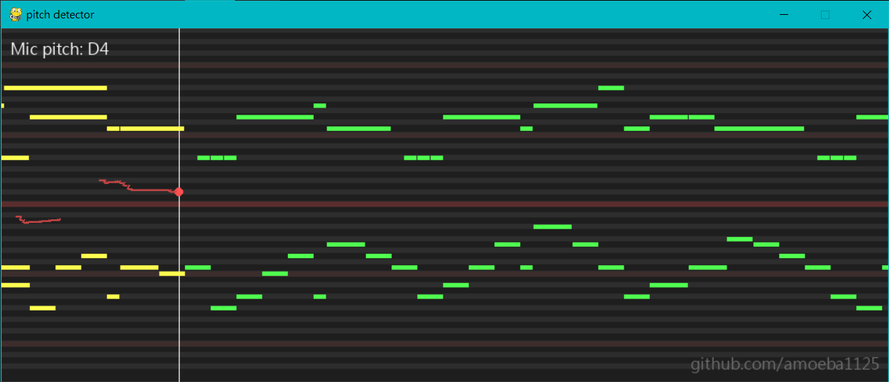

# 支援MIDI檔案的音高偵測器

這是一個可以用來判斷聲音音高的偵測器

程式會接收系統預設麥克風的聲音 並將接收到的聲音音高顯示在圖形化視窗上

同時支援輸入MIDI檔案並播放聲音樂 可以當作伴唱機使用
## 使用教學
安裝相依套件：
```
pip install pygame mido sounddevice numpy aubio
```
執行程式 (MIDI檔案可選)：
```
python pitch_detector.py [MIDI_file.mid]
```
## 常見問題
**Q: 偵測不到聲音**

A: 檢查系統預設麥克風是否為你正在使用的麥克風，重新指定麥克風後須重啟程式

**Q: 畫面上有顯示音高文字，但是沒有畫出圖形**

A: 偵測到的音高可能太高或太低，位於顯示範圍外

**Q: 程式無法執行**

A: 請確認是否正確安裝相依套件

---

# MIDI-Compatible Pitch Detector

This is a pitch detector that can be used to identify the pitch of sounds.

The program captures audio from the system's default microphone and displays the detected pitch in a graphical window.

It also supports inputting MIDI files and playing musical sounds, allowing it to be used as a karaoke machine.
## Usage Instructions

Install dependencies:
```
pip install pygame mido sounddevice numpy aubio
```
Run the program (MIDI file is optional):
```
python pitch_detector.py [MIDI_file.mid]
```
## Frequently Asked Questions

**Q: No sound is detected**

A: Please check if the system's default microphone is the one you are using. After changing the microphone, restart the program.

**Q: Pitch text is displayed on the screen, but no graphics are drawn**

A: The detected pitch might be too high or too low, outside the display range.

**Q: The program cannot run**

A: Please make sure all dependencies are correctly installed.
