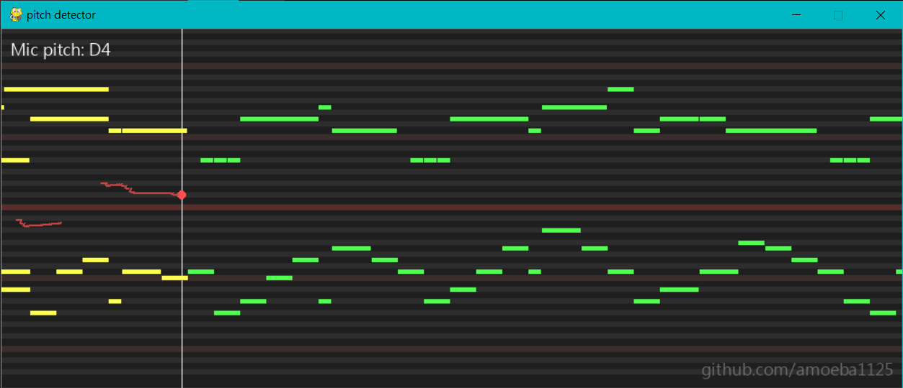

# 支援MIDI檔案的音高偵測器

這是一個可以用來判斷聲音音高的偵測器

程式會接收系統預設麥克風的聲音 並將接收到的聲音音高顯示在圖形化視窗上

同時支援輸入MIDI檔案並播放聲音樂 可以當作伴唱機使用

使用方向鍵上、下可調整麥克風音高顯示
## 使用教學
安裝相依套件：
```
pip install -r requirements.txt
```
執行程式 (MIDI檔案可選)：
```
python pitch_detector.py [MIDI_file.mid]
```
## 常見問題
**Q: 偵測不到聲音**

**A:** 檢查系統預設麥克風是否為你正在使用的麥克風，重新指定麥克風後須重啟程式

**Q: 畫面上有顯示音高文字，但是沒有畫出圖形**

**A:** 偵測到的音高可能太高或太低，位於顯示範圍外

**Q: 程式無法執行**

**A:** 請確認是否正確安裝相依套件

---

# MIDI-Supported Pitch Detector

A real-time pitch detector that identifies the pitch of your voice.

The program captures audio from the system's default microphone and displays the detected pitch in a graphical interface.

It also supports loading and playing MIDI files, allowing it to be used as a simple karaoke/practice tool.

Use the **Up** and **Down** arrow keys to adjust the displayed microphone pitch (octave shift).

## Usage

Install the required dependencies:

```bash
pip install -r requirements.txt
```

Run the program (MIDI file is optional):

```bash
python pitch_detector.py [MIDI_file.mid]
```

## FAQ

**Q: No sound is being detected.**

**A:** Make sure your system's default microphone is set to the microphone you are using. Restart the program after changing the default microphone.

**Q: The detected note name is displayed, but no pitch marker appears on the screen.**

**A:** The detected pitch may be outside the current display range because it is too high or too low.

**Q: The program won't start.**

**A:** Make sure all required dependencies have been installed correctly.